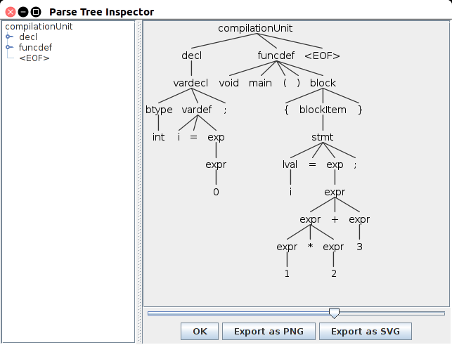
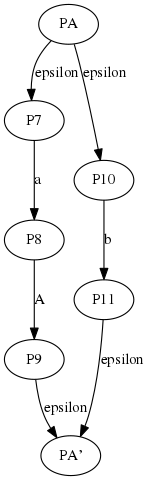

# 问题回答
## 问题1

* ANTLR4 有相应的算法可以消除直接左递归，所以它允许直接左递归，但不允许间接左递归(left-recursive)
* ANTLR内置算法会先消除左递归，当有多个alternative时，写在前面的alternative更优先匹配。例如：
  
        Exp : Exp '*' Exp | Exp '+' Exp | IntConst;

    匹配1*2+3，得到：
      

    用

        Exp : Exp '+' Exp | Exp '*' Exp | IntConst;

    匹配1*2+3，得到：
      

* 前者可以构造出‘*’比‘+’优先级高的表达式。ANTLR设计了一种规则，即当有多个alternative匹配时，前面的alternative优先级高于后面的，针对本例就是“Exp '*' Exp”高于“Exp '+' Exp”,就是乘法优先级高于加法。由此消除了二义性。
* C1ParserListerner.java文件会多出几个函数：
  
            void enterAdd(C1Parser.AddContext ctx);
            /**
            * Exit a parse tree produced by the {@code Add}
            * labeled alternative in {@link C1Parser#expr}.
            * @param ctx the parse tree
            */
            void exitAdd(C1Parser.AddContext ctx);
            /**
            * Enter a parse tree produced by the {@code Mult}
            * labeled alternative in {@link C1Parser#expr}.
            * @param ctx the parse tree
            */
            void enterMult(C1Parser.MultContext ctx);
            /**
            * Exit a parse tree produced by the {@code Mult}
            * labeled alternative in {@link C1Parser#expr}.
            * @param ctx the parse tree
            */
            void exitMult(C1Parser.MultContext ctx);
            /**
            * Enter a parse tree produced by the {@code Int}
            * labeled alternative in {@link C1Parser#expr}.
            * @param ctx the parse tree
            */
            void enterInt(C1Parser.IntContext ctx);
            /**
            * Exit a parse tree produced by the {@code Int}
            * labeled alternative in {@link C1Parser#expr}.
            * @param ctx the parse tree
            */
            void exitInt(C1Parser.IntContext ctx);

在ANTLR中，#运算符用来给一个文法最外层的alternative命名，ANTLR会根据Exp的不同的alternative生成不同的listener method，便于listener和visitor的使用，使文法有着很高的可重用性和可重定向性。

* ANTLR不支持mutually left-recursive,例子：

        s: a Minus | Plus;
        a: s Minus | Plus;
    原因：ANTLR没有相应的算法支持来消除间接左递归，而且这样很难保留动作和语义断言。

## 问题2

* 核心逻辑在于LL-star文法对可以由非终结符推导出的每一个句子正规划分，进而构造出可以匹配这些正规划分的lookahead DFA，通过DFA进行匹配和预测，得出最后的production。
  为了在不同的alternative中选择，LL-star文法可以每次lookahead任意个字符，而传统的LL文法每次只能看一个字符，因而对文法设计的限制比较严格。

* 证明：
  有规则U1={S->Ac,S->Ad},U2={A->aA,A->b}，对应的有正规划分π1={VT\*c, VT\*d}，π2={aVT\*, bVT\*},因此规则U1、U2都是LL(π)规则。所以该文法是LLR文法。

  ATN如下：

      

  DFA如下：

  

  问题：
  陷入死循环，configuration stack无限增长，因为非终结符A的文法中有递归定义A->aA。

## 问题3

* ALL(*)文法的核心逻辑在于把语法分析转移到解析时间，而不需要静态的语法分析。
  而LL(*)是静态的语法分析，并且有时候不能找到用于区分alternative的正规式，与此相比，ALL(*)更加灵活可靠

* 调用S(),调用adaptivePredict("S", call stack)，返回1，即选择alternative1，然后match('x'),调用B(),完成。
调用B()时，先调用adaptivePredict("B", call stack),返回1，即选择唯一的一个alternative，然后调用A(),match('a'),完成。
调用A()时，先调用adaptivePredict("A", call stack)，返回1，即选择alternative1，然后match('b'),完成。

DFA如下：

